# Overview

This project is a machine learning application developed in Python, utilizing the Flask framework to serve predictions on housing prices. The project is set up with Azure Pipelines for Continuous Integration and Continuous Deployment (CI/CD), enabling automated testing and deployment to Azure App Service. 

Overall, this project demonstrates a practical implementation of a machine learning application with a focus on automation, containerization, and cloud deployment, showcasing modern development practices and tools.

## Project Plan

* Trello Board: https://trello.com/b/OIEa9Lh5
* Project spreadsheet plan: https://docs.google.com/spreadsheets/d/1raPIFUOdxzkNwKN_qn7mmcsJT_YxvS1h/edit?usp=sharing&ouid=101751319652859333614&rtpof=true&sd=true

## Instructions
CI Architecture (Azure Cloud Shell):
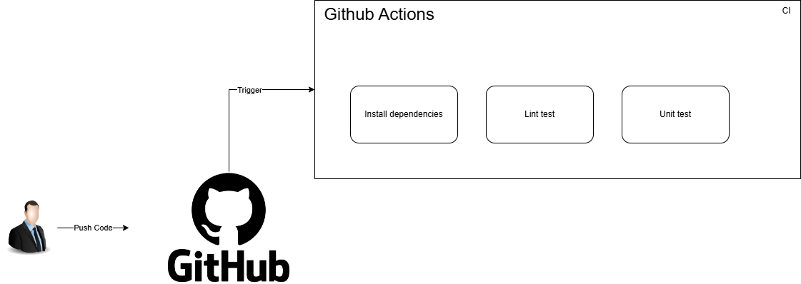
Architecture:
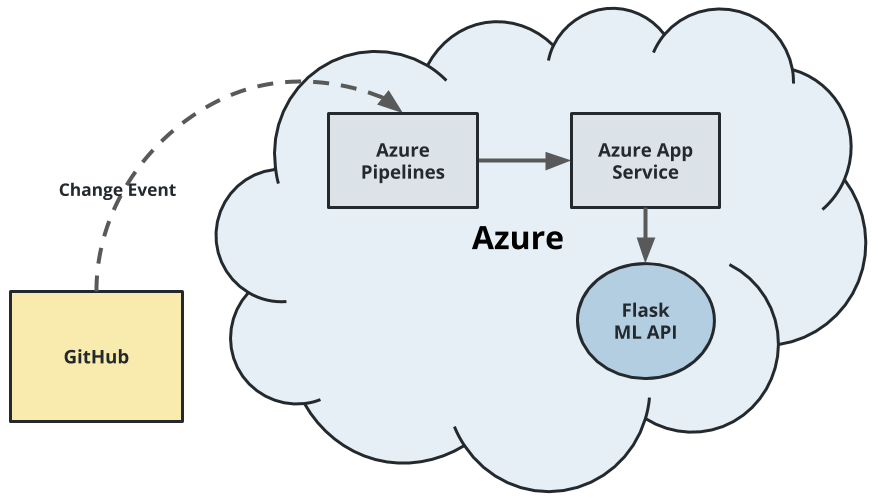

How to run locally:
* Install all dependencies
```bash
make install
```
* Test lint
```bash
make lint
```
* Unit test
```bash
make test
```
* Run the application
```bash
flask –app app.py run
```

* Project running on Azure App Service
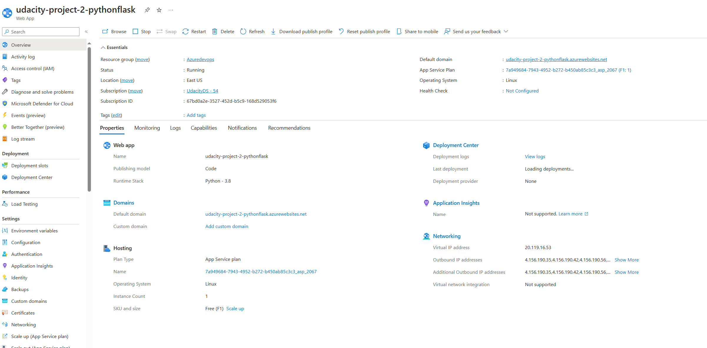
* Project cloned into Azure Cloud Shell
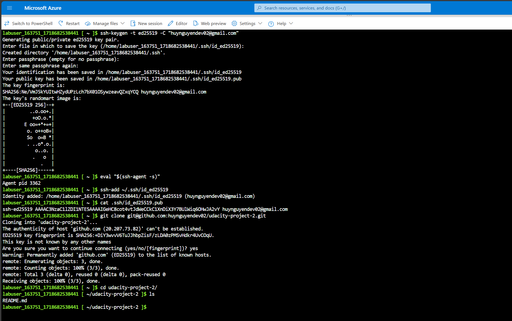
* Passing tests that are displayed after running the `make all` command from the `Makefile`
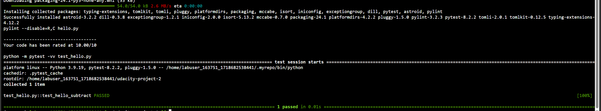
* Output of a test run of locust
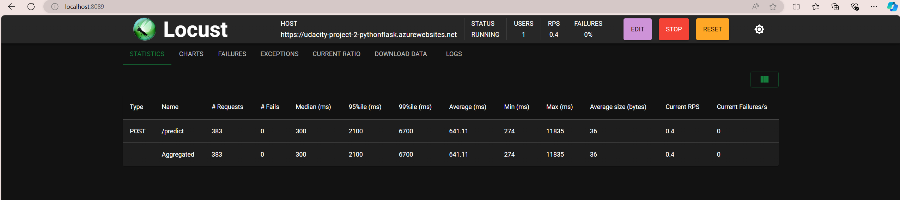
* Successful deploy of the project in Azure Pipelines.  [Note the official documentation should be referred to and double checked as you setup CI/CD](https://docs.microsoft.com/en-us/azure/devops/pipelines/ecosystems/python-webapp?view=azure-devops).
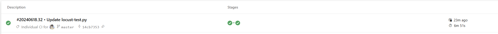
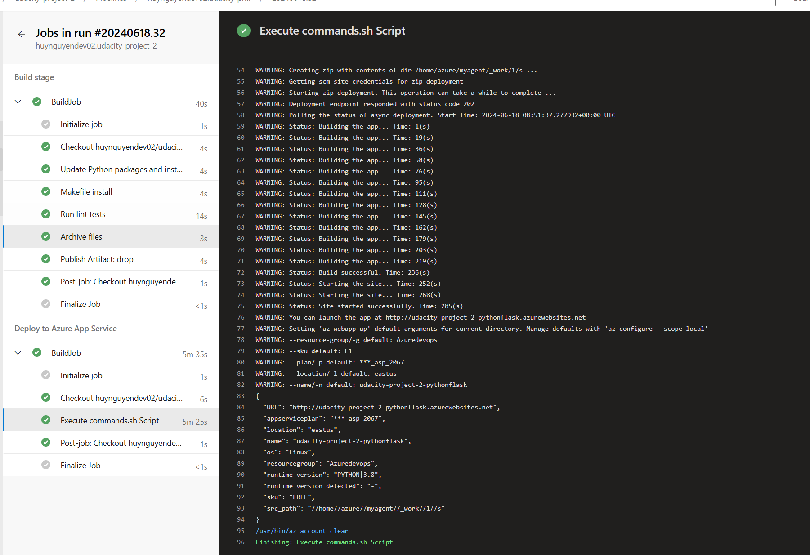
* Running Azure App Service from Azure Pipelines automatic deployment
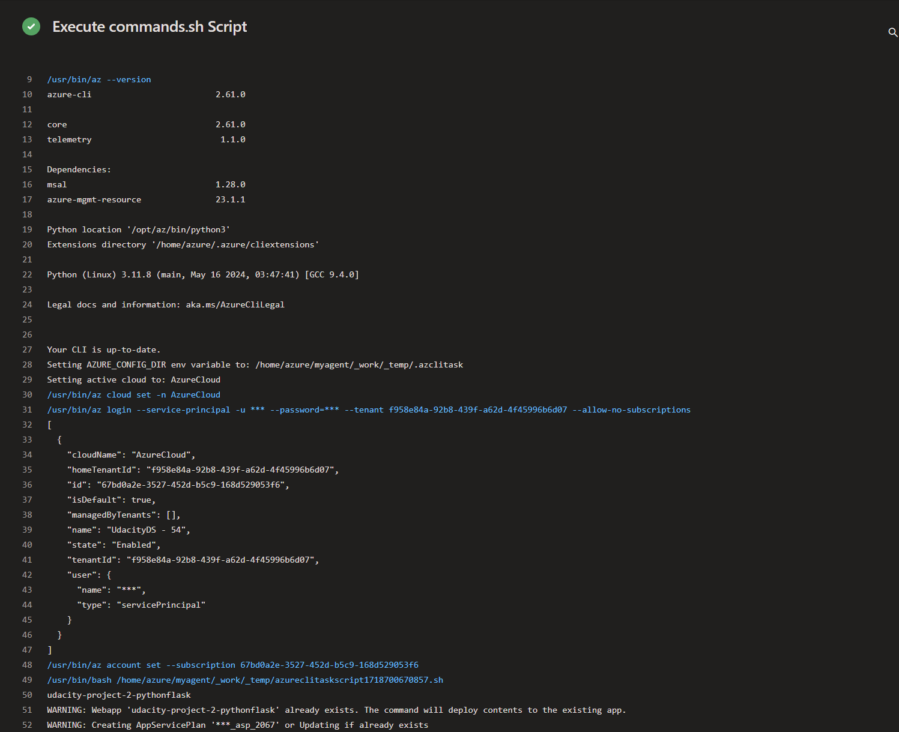
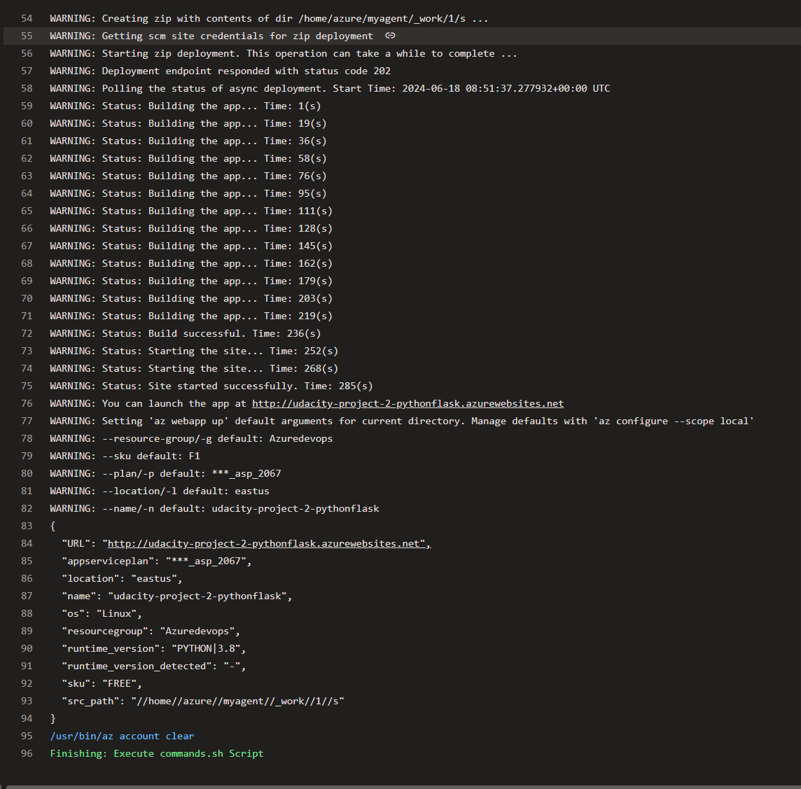
* Successful prediction from deployed flask app.
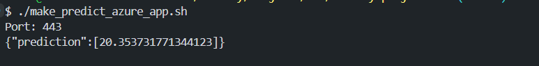

* Output of streamed log files from deployed application
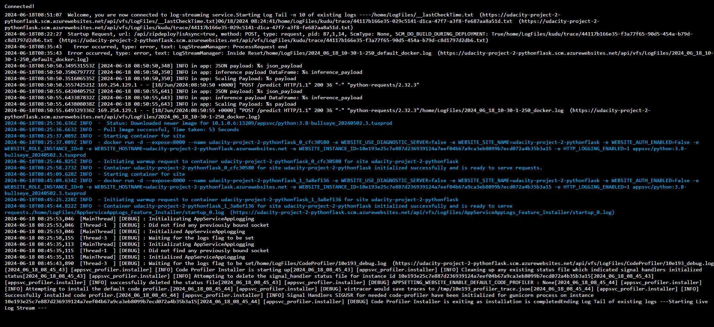
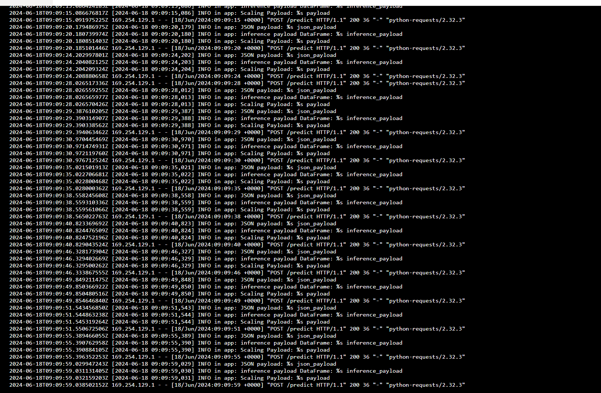
> 

## Enhancements

Future enhancements for this project could include integrating more advanced machine learning models to improve prediction accuracy and implementing a user-friendly web interface for easier interaction with the prediction system. More complex CI/CD to handle more cases.

## Demo 

Youtube: https://www.youtube.com/watch?v=81x6ncKNFyc


